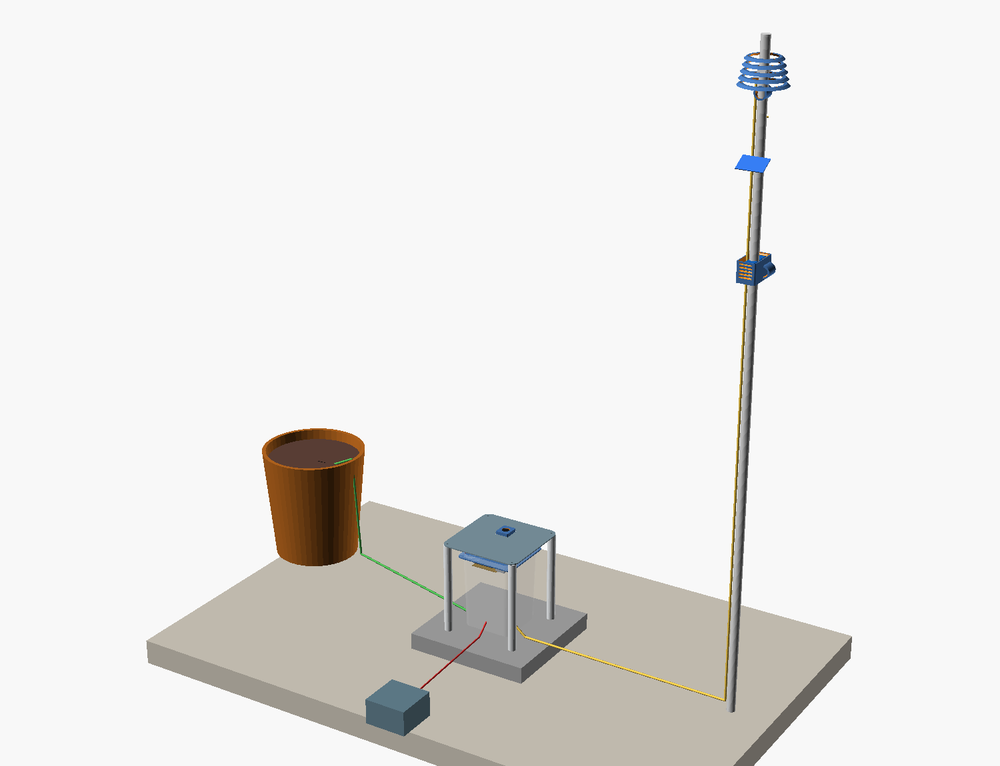
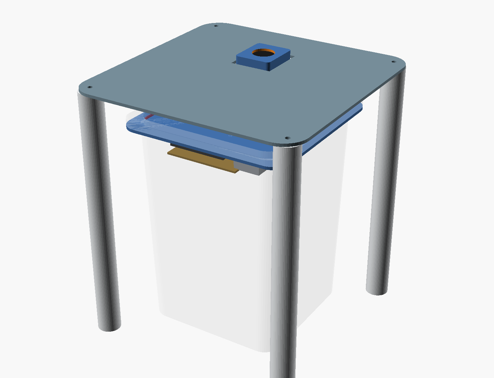
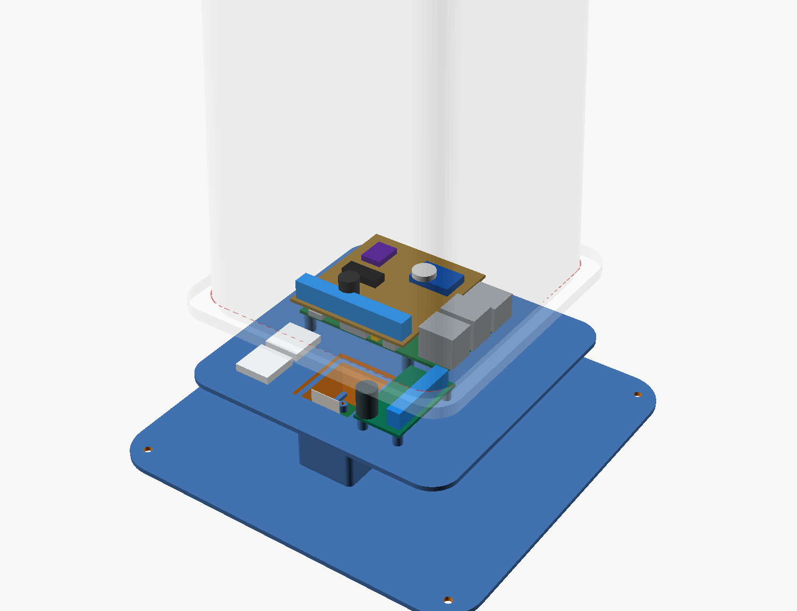
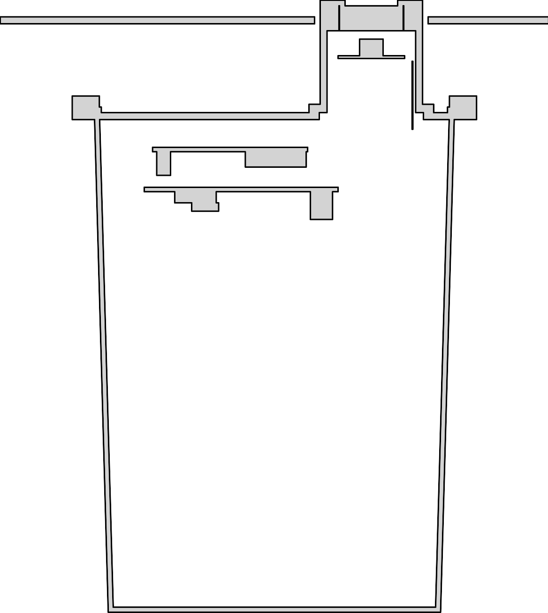
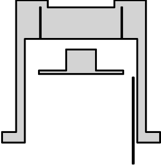
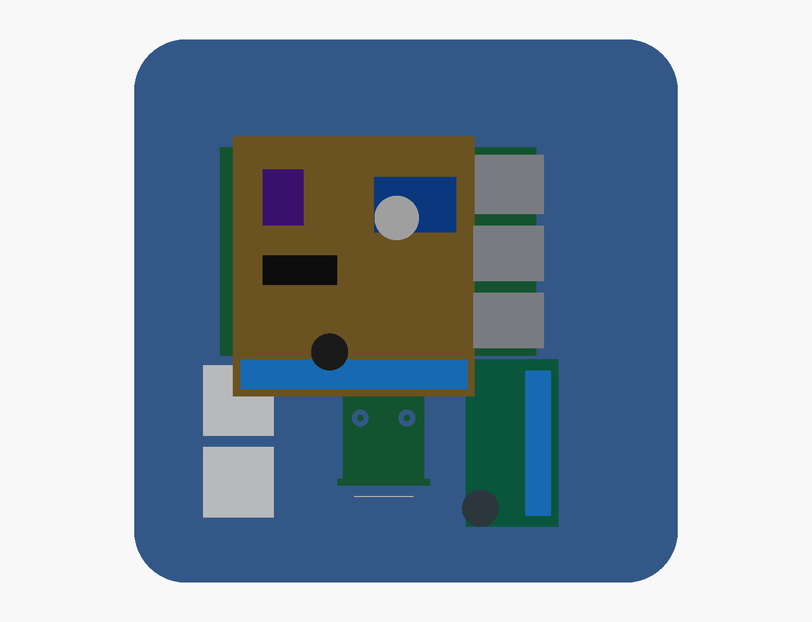
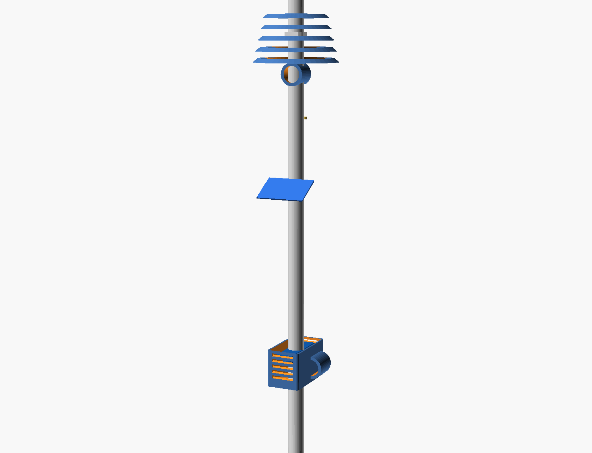
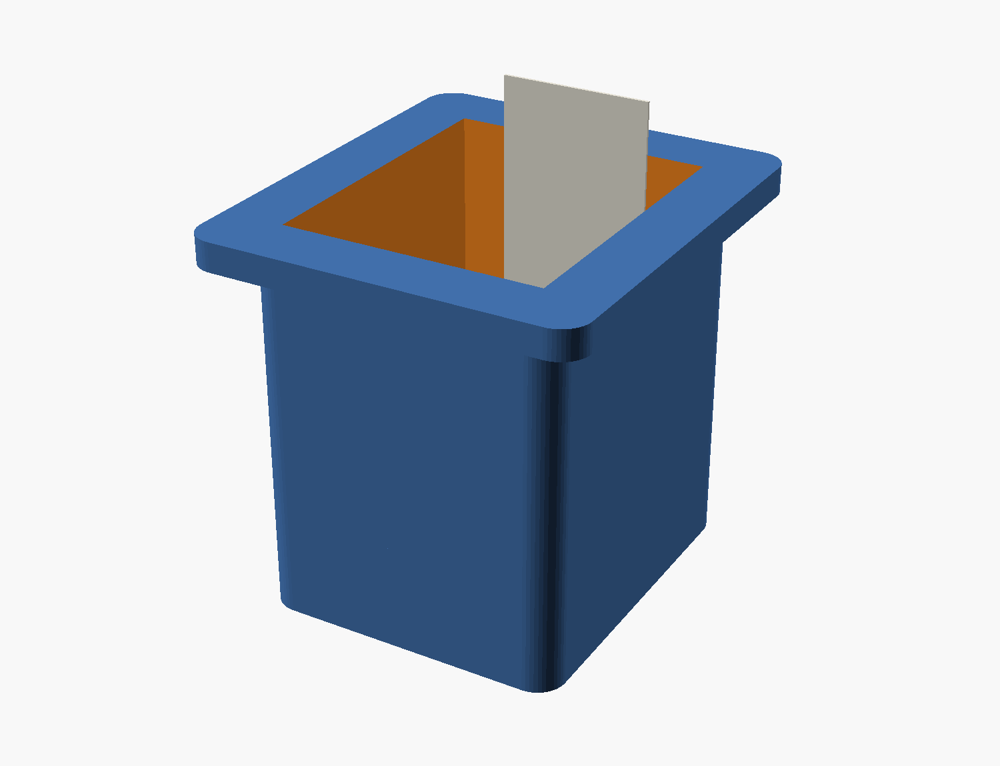
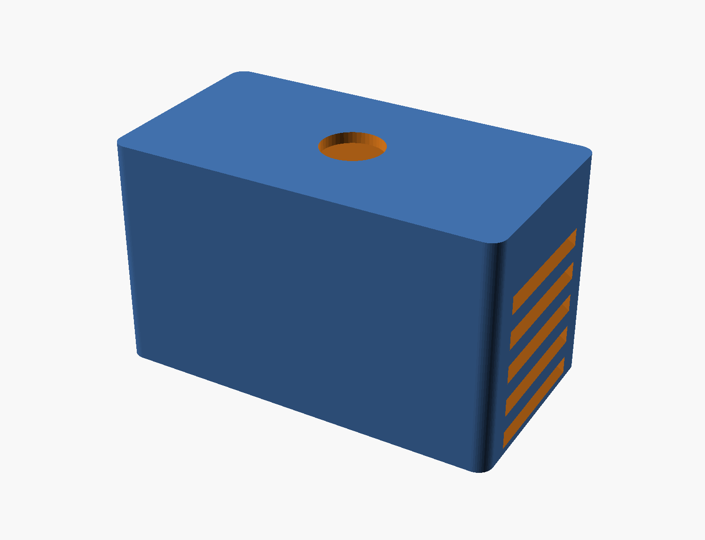

# IESH v0.2 — build documents

Everything generated for the rooftop rebuild, in one place. The narrative, faults, build
order and decisions are in [`../HANDOFF.md`](../HANDOFF.md); this page is the index of the
sheets and views you take to the bench. **Nothing here is hand-drawn** — regenerate with:

```bash
python3 scripts/gen_drawings.py      # sheets 1-4 + bench.html
docs/cad/render.sh                   # CAD renders, templates, numeric checks (~2 min)
```

## At the bench
[`../BOARD-BUILD.md`](../BOARD-BUILD.md) — **the live working doc for the board being built
now**: board coordinates, orientation anchors, layout map, power topology, steps and gates.
Hand-written and ticked off as the work happens, unlike everything else here.

## The rooftop plan
[`rooftop-plan.html`](rooftop-plan.html) — **the site plan as of 2026-10-05**: everything on the
water-tank stand, the Pi + camera head unit, cable map after the move, risks, the sky pipeline
and the gated build order. Supersedes the tile-and-mast layout in the CAD until that is redone.

## Also at the bench: `bench.html`
[`bench.html`](bench.html) — all four sheets, the key renders and the §14 gates on one
scrolling page. Open it on a phone or tablet next to the soldering iron.

## Sheets — `drawings/`
| # | File | Use it for |
|---|---|---|
| 1 | [`schematic.svg`](drawings/schematic.svg) | every net, named — the name is what you write on the wire |
| 2 | [`perfboard.svg`](drawings/perfboard.svg) | **what you solder from.** Where each block goes on the blank 100 × 150 board (57 × 37 holes), the separation rules, and the order of work with its gate |
| 3 | [`pinout.svg`](drawings/pinout.svg) | the 40-pin header with used pins coloured; every CAT5e core traced terminal → sensor pin |
| 4 | [`lid-layout.svg`](drawings/lid-layout.svg) | where to bond the standoffs and tie mounts, in mm from the lid centre — read from the CAD |

All four come from one net list in [`../scripts/gen_drawings.py`](../scripts/gen_drawings.py);
sheet 4 reads its positions from `cad/roofbox.scad`, so the sheets cannot drift from each
other or from the CAD.

## CAD — `cad/`
| File | What |
|---|---|
| [`roofbox.scad`](cad/roofbox.scad) | the container, Pi 3B+, HAT, buck, camera tower, hood table, mast, vase, cable runs — all at 1:1 |
| [`roofbox_check.py`](cad/roofbox_check.py) | the assertions a render cannot make: clashes, field, height, sky clearance, ribbon, lid cuts, glands, cable lengths |
| [`render.sh`](cad/render.sh) | regenerates everything below and runs the checks |

### Views — `cad/renders/`
| | | |
|---|---|---|
| [](cad/renders/site.png) **site** — the whole station on the roof | [](cad/renders/service.png) **service** — box on its tile, hood table, tower | [](cad/renders/exploded.png) **exploded** — hood plate / lid stack / body |
| [](cad/renders/section2d.png) **section2d** — exact cut through the tower centre | [](cad/renders/tower2d.png) **tower2d** — lip, ring pocket, ledge, board | [](cad/renders/plan.png) **plan** — lid from the inside |
| [](cad/renders/mast.png) **mast** — shield, rain plate, gas pod | [](cad/renders/cam_tower.png) **cam_tower** — the one printed part | [](cad/renders/gas_pod.png) **gas_pod** · [shield](cad/renders/shield.png) |

### Templates — `cad/templates/` (SVG in mm; print at 100 %)
| File | Use |
|---|---|
| [`roofbox_lid.svg`](cad/templates/roofbox_lid.svg) | **placement** template for the lid underside: standoff marks, tie mounts, tower-bore witness, gasket band. Not a drilling template — today the lid is not drilled |
| [`roofbox_drill_wall.svg`](cad/templates/roofbox_drill_wall.svg) | one side wall, unrolled: three 12.5 mm PG7 holes 32 mm up, the 2 mm vent high under the hood |
| `roofbox_section2d.svg`, `roofbox_tower2d.svg` | the 2D sections, as vectors |

## Photos — `reference-photos/`
The as-built cardboard circuit (the fault), the container, its gasket, the camera and
fisheye. Captioned in HANDOFF §5.

## Station-side scripts — `../scripts/`
| | |
|---|---|
| `sudo scripts/pi_config.sh --dry-run` | shows the `config.txt` diff for HANDOFF §11; run without `--dry-run` to apply |
| `python3 scripts/gate_check.py` | the §14 commissioning gates as one PASS/FAIL table, on the Pi |
| `python3 tests/test_all.py --skip camera` | hardware tests in bring-up order |
